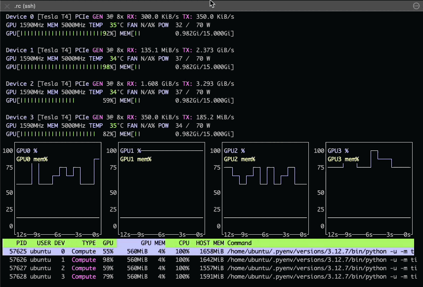

# `tiledbsoma_ml.cli`
WIP `tdbsml` CLI demonstrating distributed training with [DDP]

<!-- `bmdf tdbsml` -->
```bash
tdbsml
# Usage: tdbsml [OPTIONS] COMMAND [ARGS]...
#
# Options:
#   --help  Show this message and exit.
#
# Commands:
#   benchmark
#   test
#   train
```


<!-- `bmdf -- tdbsml train --help` -->
```bash
tdbsml train --help
# Usage: tdbsml train [OPTIONS]
#
# Options:
#   -b, --batch-size INTEGER        Mini-batch size (default: 128)
#   -i, --io-batch-size INTEGER     IO batch size (default: 65536)
#   -I, --model-in-path TEXT        Load initial model from this path
#   -l, --learning-rate FLOAT       Learning rate (default: 1e-05)
#   -m, --model-path TEXT           Load model from this path, and save it back
#                                   to this path; equivalent to setting both
#                                   `-I/--model-in-path` and `-O/--model-out-
#                                   path` to this value
#   -n, --n-epochs INTEGER          Train for this many epochs (default: 20)
#   -O, --model-out-path TEXT       Save trained model to this path
#   -s, --shuffle-chunk-size INTEGER
#                                   Shuffle-chunk size (default: 64)
#   -S, --seed INTEGER              PRNG seed
#   -t, --tissue TEXT               "tissue_general" obs filter
#   -v, --census-version TEXT       Census version to train on (default:
#                                   2024-07-01)
#   -w, --num-workers INTEGER       Number of DataLoader workers
#   --local-rank INTEGER            Used for distributed training (automatically
#                                   set by torch.distributed.launch)
#   --help                          Show this message and exit.
```


### Example invocation
```bash
python -m torch.distributed.launch \
  --nproc_per_node=4 \
  -m tiledbsoma_ml.cli.train \
  --tissue "lung" \
  --n-epochs 10 \
  --model-out-path trained_model.pth
```

[`nvtop`] screencast excerpt (on 4-GPU [m6a.16xlarge]:




[DDP]: https://pytorch.org/tutorials/intermediate/ddp_tutorial.html
[`nvtop`]: https://github.com/Syllo/nvtop
[m6a.16xlarge]: https://instances.vantage.sh/aws/ec2/m6a.16xlarge
