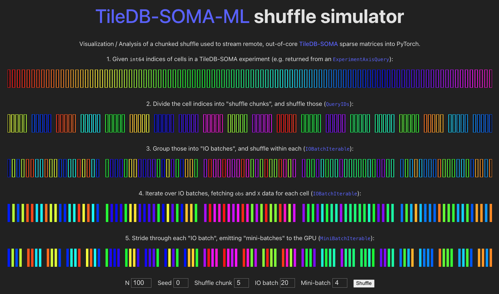

# TileDB-SOMA-ML shuffle simulator

Live demo: [single-cell-data.github.io/TileDB-SOMA-ML/shuffle]:

[][single-cell-data.github.io/TileDB-SOMA-ML/shuffle]

Dev build:
```bash
npm i -g pnpm  # Install pnpm
pnpm i         # Install project deps
npm run dev    # Start dev server
```

Prod build:
```bash
npm run build  # Build site under www/dist/shuffle/
```

[docs/Makefile] can also build the Sphinx/RTD site, and combine it with this one, under `dist/`:
```bash
make dist
```
This performs the following steps:
1. Build [docs/]  (`make html` outputs site under `_build/html/`)
2. Build www/   (outputs shuffle viz at `dist/shuffle/`)
3. `cp -r _build/html/* www/dist/`  (combine 1. and 2. under `www/dist/`)

See [docs/] for more info; the [`ghp.yml`] GHA also performs these steps, and deploys `www/dist` to [single-cell-data.github.io/TileDB-SOMA-ML].

[single-cell-data.github.io/TileDB-SOMA-ML]: https://single-cell-data.github.io/TileDB-SOMA-ML/
[single-cell-data.github.io/TileDB-SOMA-ML/shuffle]: https://single-cell-data.github.io/TileDB-SOMA-ML/shuffle/
[docs/Makefile]: ../docs/Makefile
[docs/]: ../docs/
[`ghp.yml`]: ../.github/workflows/ghp.yml
